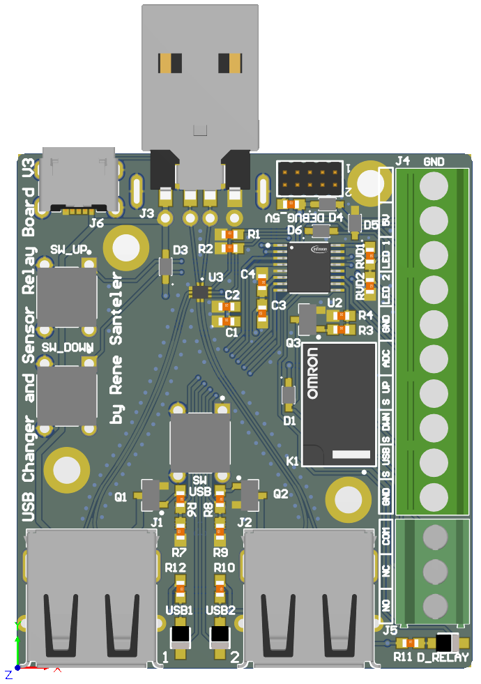

<!--
*** Thanks for checking out the Best-README-Template. If you have a suggestion
*** that would make this better, please fork the repo and create a pull request
*** or simply open an issue with the tag "enhancement".
*** Thanks again! Now go create something AMAZING! :D
-->

<!-- PROJECT SHIELDS -->
<!--
*** I'm using markdown "reference style" links for readability.
*** Reference links are enclosed in brackets [ ] instead of parentheses ( ).
*** See the bottom of this document for the declaration of the reference variables
*** for contributors-url, forks-url, etc. This is an optional, concise syntax you may use.
*** https://www.markdownguide.org/basic-syntax/#reference-style-links
-->
[![Contributors][contributors-shield]][contributors-url]
[![Forks][forks-shield]][forks-url]
[![Stargazers][stars-shield]][stars-url]
[![Issues][issues-shield]][issues-url]
<!-- [![MIT License][license-shield]][license-url] -->

<!-- PROJECT LOGO -->
 

  

  <h3 align="center"></h3>

  

    A Infineon XMC1100 powered system used to switch between 2 USB Devices and to control a relay based on a sensor input with configurable hysteresis.
     
    <!-- <a href="https://github.com/MechResato/USB_Changer"><strong>Explore the docs »</strong></a> 
     -->
     
    <!-- <a href="https://github.com/MechResato/USB_Changer">View Demo</a> 
    ·
    -->
    <a href="https://github.com/MechResato/USB_Changer/issues">Report Bug</a>
    ·
    <a href="https://github.com/MechResato/USB_Changer/issues">Request Feature</a>
  

<!-- TABLE OF CONTENTS -->

  
<h2 style="display: inline-block">Table of Contents</h2>

  <ol>
    <li><a href="#description">Description</a></li>
    <li><a href="#getting-started">Getting Started</a></li>
    <li><a href="#usage">Usage</a></li>
    <li><a href="#contact">Contact</a></li>
    <li><a href="#acknowledgements-and-resources">Acknowledgements and Resources</a></li>
  </ol>

## Description

This project aims to develop a PCB used to switch USB sources/sinks on button press and to provide an analog input (ADC) used to control a relay with hysteresis and latch time. Furthermore it implements a simple setup menu structure to adjust hysteresis thresholds and latch time. All buttons, the USB-LEDs, ADC and realy pins are accessible with an screw terminal.

It is intended to run on the 5V provided by the USB, but it is possible to supply it externally using the 5V terminal (set diode D4 accordingly). Note that the power line of the currently disabled USB port will be disconnected in order to keep the current low.

With slight software modification of the software it would also be possible switch the USB Ports based on the ADC pin or to control the power pins of USB differently.

A possible application is the use at a car radio with only one USB port. In this case a external button can be used to switch between e.g. a phone and a USB Stick as input. The sensor controlled relay may be used with a brightness sensor to control the display illumination.

<!-- GETTING STARTED -->

## Getting Started

The application is developed with Infineon [DAVE 4.5.0](https://softwaretools.infineon.com/tools/com.ifx.tb.tool.daveide). You need to download the project and import it into the DAVE workspace. Make sure it is imported correctly and set as active project. Next use the "Rebuild Active Project" button to compile it and use the "Debug" button to flash it. If you a window pops up just double click "GDB SEGGER J-Link Debugging" and it should configure it self automatically. 

<b>Note:</b> Make sure that the programmer is plugged in and that the project is already build at least once (the compiled ".elf" file and the connection is needed for automated configuration).
In order to flash a XMC 1100 microcontroller, a genuine j-link flasher or a infineon programmer is needed (later ones are usually based on XMC 4200 and included on most prototyping boards). In case of the XMC based programmer you might need to enter the "BMI Set And Get" menu of DAVE and change the settings accordingly (SWDIO=P0.14, SWCLK=P0.15, untested).

After it is first programmed the emulated EEPROM holding the setup information is still empty, which will be displayed as an error (blinking at startup). This is normal - you need set a value for all 3 setup parameters and safe them to initially write the information to EEPROM (see section Usage).

<!-- USAGE -->
## Usage

<h3>USB</h3>

When plugged in the center button (or "S USB" pin) is used to switch the USB Port. The USB LEDs (and pins) inidicate the currently active port.

<h3>Sensor Controlled Relay</h3>

The relay output changes from low to high if the ADC input value exceed the upper threshold for longer than the latch time. It changes back to low if the ADC input value subceeds the lower threshold for longer than the latch time. The current state is indicated by the LED "D_RELAY".

These 3 setup values (upper threshold, lower threshold and latch time) can be manipulated using the "UP" and "DOWN" buttons (or pins) as described in the next section.

<h3>Setup</h3>

For every setup vale there is a setup menu. They can be navigated by pressing the "UP" and "DOWN" Buttons 3 ways: A short press is shorter than 1 second, a long press is shorter than 4 seconds and the longest detected press is at 4 seconds:

<h4>Upper Threshold Setup</h4>

To enter the upper threshold menu a short press of the UP is needed. The relay status led will fade up repeadetly to indicate this. Now the threshold can be in/decreased using the UP and DOWN buttons. The setting will be saved if a long press of the UP or DOWN button is detected. Inside the menu it is also possible to set the current sensor ADC value as this threshold by holding the UP button until the status led starts flashing (longest press time - this will also exit the menu).

The threshold can be set in 35 steps.

<h4>Lower Threshold Setup</h4>

To enter the lower threshold menu a short press of the DOWN is needed. The relay status led will fade down repeadetly to indicate this. Now the threshold can be in/decreased using the UP and DOWN buttons. The setting will be saved if a long press of the UP or DOWN button is detected. Inside the menu it is also possible to set the current sensor ADC value as this threshold by holding the DOWN button until the status led starts flashing (longest press time - this will also exit the menu).

The threshold can be set in 35 steps.

<h4>Latch Time Setup</h4>

To enter the latch time menu a long press of UP or DOWN is needed. The relay status led will blink repeadetly to indicate this. Now the time can be in/decreased using the UP and DOWN buttons. The setting will be saved if a long press of the UP or DOWN button is detected. 

Every press of UP or DOWN changes the threshold by 250 ms.

<!-- CONTACT -->

## Contact

<!-- Your Name - [@twitter_handle](https://twitter.com/twitter_handle) - email -->

Project Link: [https://github.com/MechResato/USB_Changer](https://github.com/MechResato/USB_Changer)

by Rene Santeler

<!-- ACKNOWLEDGEMENTS & RESOURCES -->
## Acknowledgements and Resources

* Infineon - DAVE APP "E_EEPROM_XMC1" - Emulates a portion of flash as an EEPROM for data storage.
* Infineon - DAVE APP "PWM_CCU4" - PWM APP using one timer slice of CCU4, with external events support, to generate a PWM output.
* Infineon - DAVE APP "ADC_MEASUREMENT" - Incorporates analog to digital conversion for the required measurements.
* Infineon - DAVE APP "DIGITAL_IO" - Used to configure a port pin as digital Input/Output.
* Infineon - DAVE APP "SYSTIMER" - Uses the SysTick interrupt to keep track of the system time.
* [othneildrew - Best-README-Template](https://github.com/othneildrew/Best-README-Template)

<!-- MARKDOWN LINKS & IMAGES -->
<!-- https://www.markdownguide.org/basic-syntax/#reference-style-links -->
[contributors-shield]: https://img.shields.io/github/contributors/MechResato/USB_Changer.svg?style=for-the-badge
[contributors-url]: https://github.com/MechResato/USB_Changer/graphs/contributors
[forks-shield]: https://img.shields.io/github/forks/MechResato/USB_Changer.svg?style=for-the-badge
[forks-url]: https://github.com/MechResato/USB_Changer/network/members
[stars-shield]: https://img.shields.io/github/stars/MechResato/USB_Changer.svg?style=for-the-badge
[stars-url]: https://github.com/MechResato/USB_Changer/stargazers
[issues-shield]: https://img.shields.io/github/issues/MechResato/USB_Changer.svg?style=for-the-badge
[issues-url]: https://github.com/MechResato/USB_Changer/issues
<!-- [license-shield]: https://img.shields.io/github/license/MechResato/USB_Changer.svg?style=for-the-badge -->
<!-- [license-url]: https://github.com/MechResato/USB_Changer/blob/master/LICENSE.txt -->
